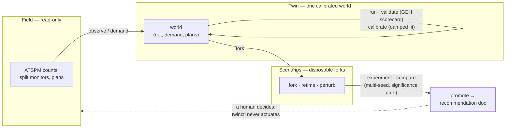

# twinctl

A `git`-style command-line control surface for a traffic digital twin: it builds, calibrates, validates, and experiments on a SUMO copy of a real signalized corridor, driven from real controller data (ATSPM). It never touches field equipment — its terminal verb, `promote`, writes a recommendation for a human, not a command for a signal.

```sh
pip install -e .          # installs the `twinctl` command (python -m twinctl works too)
twinctl worlds            # run from a directory containing worlds/, or set $TWIN_ROOT
```

## Architecture

Three layers, three levels of write access. Every verb lives on exactly one of them.



The trust boundary is the design: reality flows in, recommendations flow out, and nothing in between can write backwards. Worlds live under `<root>/worlds/`, where the root resolves as `$TWIN_ROOT` → the package's parent if it holds `worlds/` → the current directory. The full design spec is at [`docs/twinctl-spec.html`](docs/twinctl-spec.html).

## Inspirations from the field

- **git** — one binary, many verbs, terse machine-friendly output (one fact per line, `--json` everywhere), built to be driven by humans and unattended agents alike.
- **FHWA Traffic Analysis Toolbox** — the validation scorecard follows the standard calibration convention: GEH < 5 on the large majority of measured movements, checked before any world is trusted with an experiment.
- **ATSPM (Automated Traffic Signal Performance Measures)** — the field layer is the public high-resolution controller data agencies already publish; the twin is only ever graded against measured reality.
- **simctl** — a predecessor control CLI for a different simulator; twinctl adapts its fork/perturb/experiment vocabulary to the trust constraints of live public infrastructure.
- **Digital-twin practice** (ISO 23247 lineage) — the strict field / twin / scenario layering, and the rule that promotion produces a document, never an actuation.

## Contributing

PRs welcome. Ground rules:

1. **Keep the layering honest.** No verb may write toward the field layer. If a change would let the tool actuate anything real, it doesn't belong here.
2. **Match the house style.** Verbs read like git subcommands; default output is terse text, and every verb that prints must also support `--json`.
3. **Preserve determinism.** Same world + same seed must reproduce the same run. Beware ordering: e.g. flow-definition order feeds jtrrouter's RNG stream, so keep dict/emission order stable.
4. **Stay light.** Dependencies are `sumolib` plus the standard library; propose anything heavier in an issue first.
5. Branch from `main`, keep PRs focused on one verb or one fix, and show a before/after run (`twinctl validate` output or equivalent) in the description.
